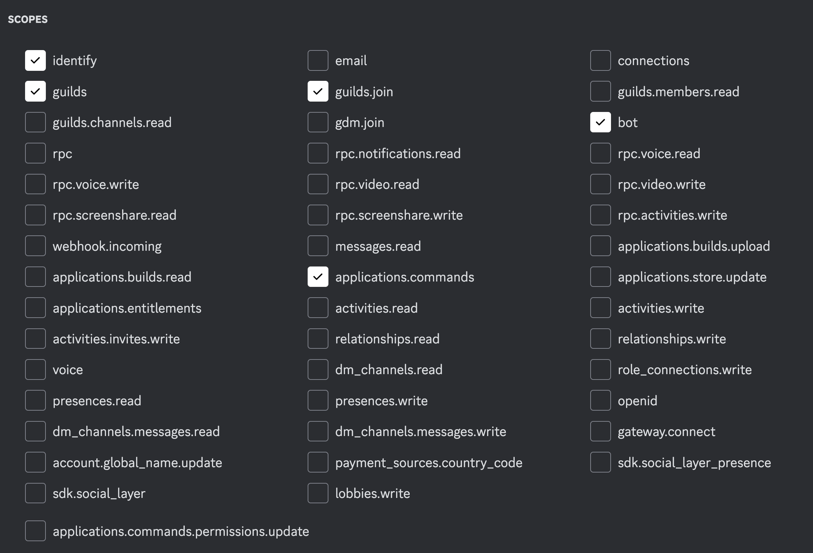
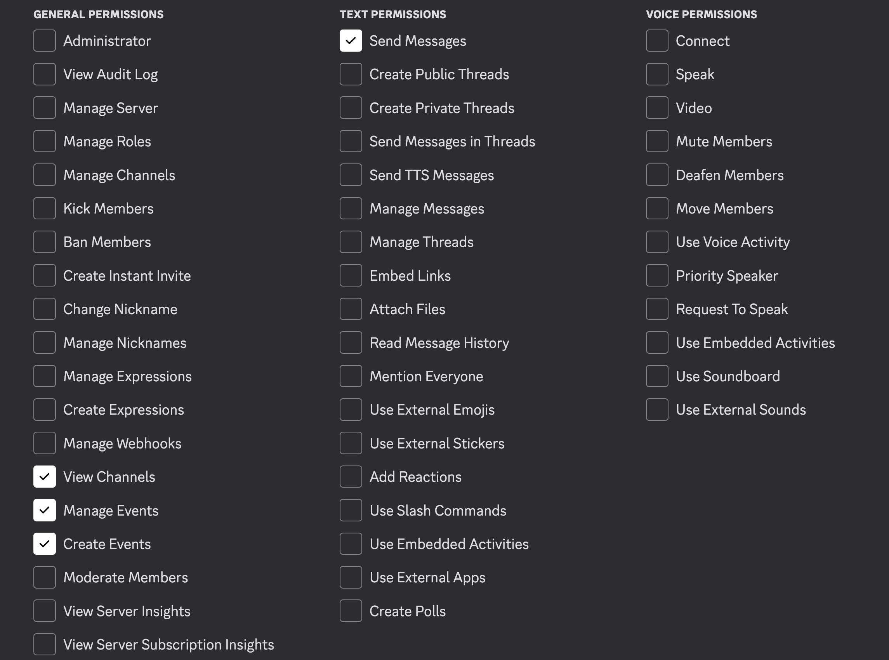

# GCALBOT

- Behaviour
    - Automatically Push, Pull and Sync every 24 hrs
    - Assign use name strings as ids to matching events in both places so if one changes it can sync
    - keep as persistent data
- Per Server Data
    - A specific calendar to sync
- Commands
    - Push command (puts discord events in gcal)
    - Pull command (pulls gcal events into discord)
    - Sync command (syncs info of all events with the same names)
    - Plans command (spits out a list of whats happening the next 2 weeks with day of week)
- Events
    - location
    - date and time
    - name of event

TODO:
improve efficiency o(n^2) time for push and pull. comebine into a sync somehow maybe?
better implementation for a blank default location
invite to calendar command

needs token and calendar_id in the .env file. needs a .credentials folder at the root of the project with the google oauth service for authentication according to the gcsa library

